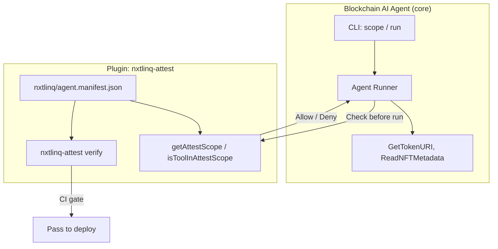
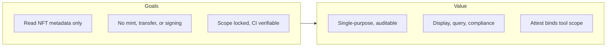
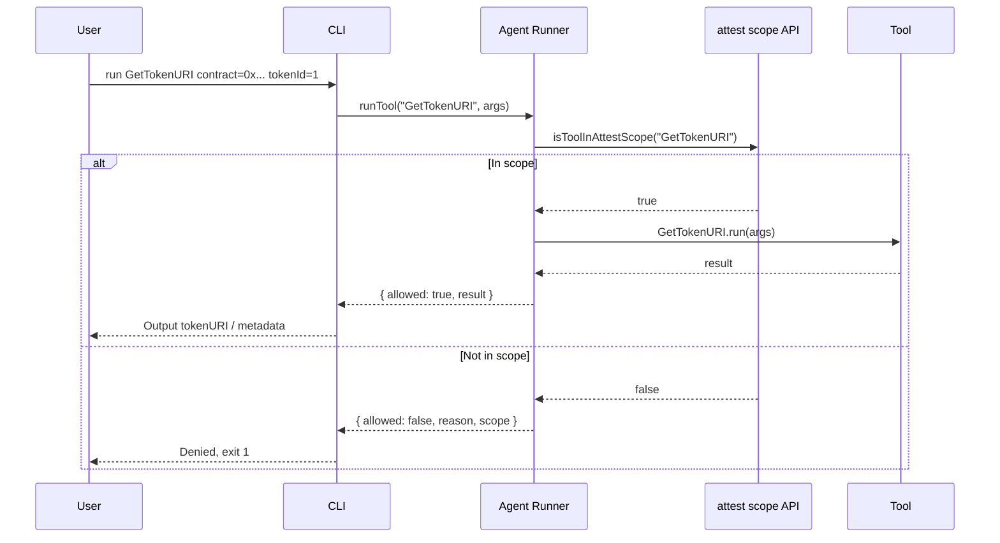
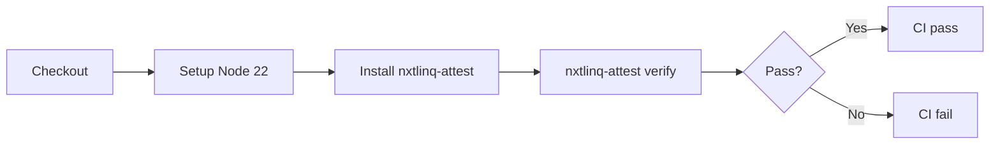

# Blockchain AI Agent Product Specification

---

## 1. Overview

### 1.1 Product positioning

Blockchain AI Agent is focused on **reading NFT metadata**: it resolves `tokenURI` for a given contract and tokenId, then fetches and parses metadata (name, description, image, attributes) from that URI (IPFS, HTTP, etc.). It does not mint, transfer, or perform any writes; permissions are locked to two tools via the nxtlinq-attest plugin for audit and compliance.

### 1.2 Core capabilities

| Capability | Description |
|------------|-------------|
| **GetTokenURI** | Get tokenURI for a contract address and tokenId (ERC-721 / ERC-1155). Implemented via RPC call to `tokenURI(tokenId)`. |
| **ReadNFTMetadata** | Fetch and parse NFT metadata JSON from a given URI (name, description, image, attributes). Supports IPFS, HTTP, etc. |

Only tools declared in the **attested scope** may run; requests for tools outside scope are denied.

### 1.3 System architecture



### 1.4 Goals and value



| Value | Description |
|-------|-------------|
| **Single-purpose** | Scope is limited to GetTokenURI and ReadNFTMetadata; easy to explain and audit. |
| **Read-only** | No private keys, no transactions; suitable for frontend display, support queries, compliance reporting. |
| **CI gate** | Running attest verify in CI ensures code and declaration are not tampered. |

### 1.5 Relationship with attest

Blockchain AI Agent **uses** nxtlinq-attest as a plugin; the product name does not tie to attest.

- **Core product**: Blockchain AI Agent (read tokenURI and metadata).
- **Plugin**: nxtlinq-attest provides manifest signing, verification, and runtime scope API; the agent enforces execution only for tools in scope via `isToolInAttestScope(toolName)`.
- **Naming**: Product name is Blockchain AI Agent (blockchain-ai-agent), without nxtlinq/attest.

---

## 2. Functional specification

### 2.1 CLI commands

| Command | Description |
|---------|-------------|
| `blockchain-ai-agent scope` | Output current attested scope (from nxtlinq/agent.manifest.json) as JSON. |
| `blockchain-ai-agent run <tool> [key=val ...]` | Run the given tool; if not in scope, deny and list scope. |

### 2.2 Tools and parameters

| Tool | Parameters | Description |
|------|-------------|-------------|
| GetTokenURI | `contract`, `tokenId` | Get tokenURI for that contract and tokenId (mock or RPC). |
| ReadNFTMetadata | `uri` | Fetch and parse NFT metadata from URI (mock or fetch). |

### 2.3 Execution flow



---

## 3. Project structure

### 3.1 Directories and files

```
blockchain-ai-agent/
├── src/
│   ├── agent.ts      # runTool, getScope; enforce scope via attest
│   ├── tools.ts      # GetTokenURI, ReadNFTMetadata
│   └── cli.ts        # CLI entry
├── nxtlinq/          # Managed by nxtlinq-attest (plugin)
│   ├── agent.manifest.json
│   ├── agent.manifest.sig
│   ├── public.key
│   └── private.key   # Do not commit
├── docs/
│   ├── index.html
│   └── spec/
│       ├── blockchain-ai-agent-product-spec.md
│       └── blockchain-ai-agent-product-spec.en.md
├── .github/workflows/attest.yml
├── package.json
└── README.md
```

### 3.2 Scope design (narrow domain)

| Item | Description |
|------|-------------|
| **GetTokenURI** | Read tokenURI from chain or known source only; no writes, no sending transactions. |
| **ReadNFTMetadata** | Read and parse JSON metadata from URI only; no on-chain or file writes. |

Out of scope: signing, sending transactions, mint, transfer, arbitrary file writes. Clear permission boundary for blockchain compliance and audit.

---

## 4. CI and verification

### 4.1 CI flow



On every push/PR, `.github/workflows/attest.yml` runs `nxtlinq-attest verify` in the project root; failure fails CI.

### 4.2 Developer workflow

1. **Initial setup**: `nxtlinq-attest init`, edit manifest `name` (blockchain-ai-agent) and `scope` (GetTokenURI, ReadNFTMetadata), then `nxtlinq-attest sign`.
2. **Code or scope change**: Re-run `nxtlinq-attest sign`, or CI verify will fail due to hash mismatch.
3. **Do not commit**: `nxtlinq/private.key`.

---

## 5. Specification summary

| Item | Description |
|------|-------------|
| **Product name** | Blockchain AI Agent (blockchain-ai-agent) |
| **Core capabilities** | Read tokenURI; read and parse NFT metadata |
| **Permission model** | Only run attested scope: GetTokenURI, ReadNFTMetadata |
| **Plugin** | nxtlinq-attest (signing, verification, scope API) |
| **CI** | GitHub Actions runs nxtlinq-attest verify |
