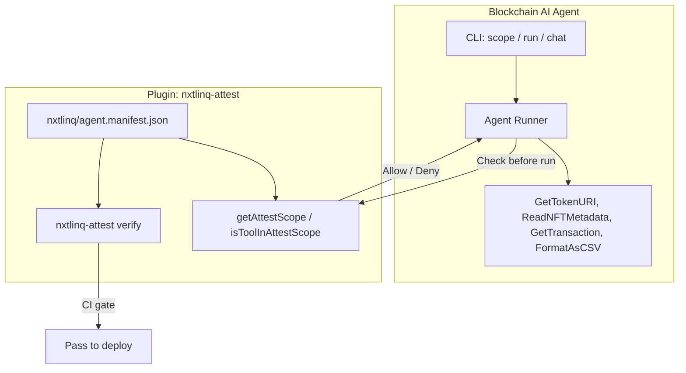
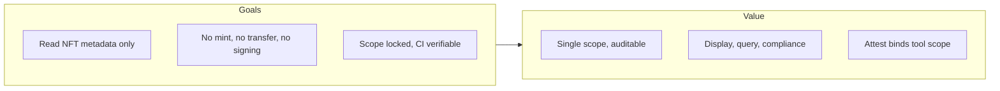
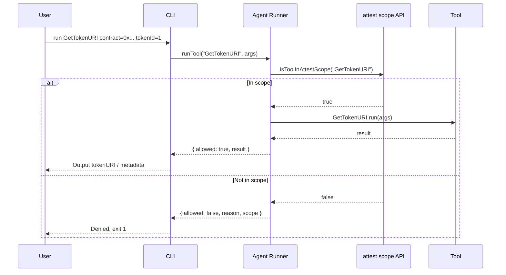
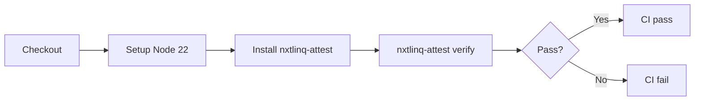

# Blockchain AI Agent — Product Specification

---

## 1. Overview

### 1.1 Product positioning

Blockchain AI Agent focuses on **reading NFT metadata** and **querying on-chain transactions**: query `tokenURI` by contract and tokenId, fetch and parse metadata (name, description, image, attributes) from URIs (IPFS, HTTP, etc.), and look up transactions and receipts by tx hash (Ethereum, Arbitrum One, Arbitrum Nova). It can also format data as CSV and write to the `output/` folder. It does not perform mint, transfer, or any chain write operations; permissions are locked by the nxtlinq-attest plugin to the declared tools for audit and compliance.

### 1.2 Core capabilities

| Capability | Description |
|------------|-------------|
| **GetTokenURI** | Get tokenURI for a contract address and tokenId (ERC-721 / ERC-1155). Implemented via RPC call to `tokenURI(tokenId)`. |
| **ReadNFTMetadata** | Fetch and parse NFT metadata JSON from a given URI (name, description, image, attributes, etc.). Supports IPFS, HTTP, etc. |
| **GetTransaction** | Fetch transaction and receipt by tx hash. Supports chainId (1 = Ethereum, 42161 = Arbitrum One, 42170 = Arbitrum Nova). |
| **FormatAsCSV** | Convert JSON to CSV; optional `output` writes to `output/` (folder created if missing). Numeric/status fields formatted per Blockscout-style. |

Only tools declared in the **attested scope** may run; requests for tools outside scope are rejected.

### 1.3 System architecture



### 1.4 Goals and value



| Value | Description |
|-------|-------------|
| **Single scope** | Scope contains only GetTokenURI, ReadNFTMetadata (and other declared tools); easy to explain and audit. |
| **Read-only** | No private keys, no sending transactions; suitable for frontend display, support queries, compliance reports. |
| **CI gate** | Run attest verify in CI to ensure code and manifest are not tampered with. |

### 1.5 Relationship with attest

Blockchain AI Agent **uses** nxtlinq-attest as a plugin; the product name is not tied to attest.

- **Core**: Blockchain AI Agent (reads tokenURI, metadata, and on-chain transactions; can export data as CSV).
- **Plugin**: nxtlinq-attest provides manifest signing, verification, and runtime scope API; the agent uses `isToolInAttestScope(toolName)` to allow only tools in scope.
- **Naming**: Product name is Blockchain AI Agent (or blockchain-ai-agent), not nxtlinq/attest.

---

## 2. Functional specification

### 2.1 CLI commands

| Command | Description |
|---------|-------------|
| `blockchain-ai-agent scope` | Output the current attested scope (from nxtlinq/agent.manifest.json) as JSON. |
| `blockchain-ai-agent run <tool> [key=val ...]` | Run the given tool; if the tool is not in scope, reject and list scope. |
| `blockchain-ai-agent chat <message>` | Natural-language query; AI calls tools as needed (requires OPENAI_API_KEY). Still gated by attest scope. |

### 2.2 Tools and parameters

| Tool | Parameters | Description |
|------|-------------|-------------|
| GetTokenURI | `contract`, `tokenId` | Get tokenURI for that contract and tokenId (mock or RPC). |
| ReadNFTMetadata | `uri` | Fetch and parse NFT metadata from URI (mock or fetch). |
| GetTransaction | `txHash`, `chainId` (optional, default 42170) | Fetch transaction and receipt by hash via chain RPC. |
| FormatAsCSV | `data` (JSON string), `columns` (optional), `output` (optional) | Convert JSON to CSV; if `output` is set, write to `output/<path>`. |

### 2.3 Execution flow



---

## 3. Project structure

### 3.1 Directories and files

```
blockchain-ai-agent/
├── src/
│   ├── agent.ts      # runTool, getScope; allow/deny by attest scope
│   ├── tools.ts      # GetTokenURI, ReadNFTMetadata, GetTransaction, FormatAsCSV
│   └── cli.ts        # CLI entry
├── nxtlinq/          # Managed by nxtlinq-attest (plugin)
│   ├── agent.manifest.json
│   ├── agent.manifest.sig
│   ├── public.key
│   └── private.key   # Do not commit
├── docs/
│   ├── index.html
│   └── spec/
│       ├── blockchain-ai-agent-product-spec.md   # English (default)
│       └── blockchain-ai-agent-product-spec.zh.md   # Chinese
├── .github/workflows/attest.yml
├── package.json
└── README.md
```

### 3.2 Scope design

| Item | Description |
|------|-------------|
| **GetTokenURI** | Read tokenURI from chain or known source only; no writes, no sending transactions. |
| **ReadNFTMetadata** | Read and parse JSON metadata from URI only; no writes to chain. |
| **GetTransaction** | Read transaction and receipt from chain RPC only; no writes. |
| **FormatAsCSV** | Convert in-memory JSON to CSV; may write to `output/` under cwd only. |

Examples not in scope: signing, sending transactions, mint, transfer, arbitrary file writes outside `output/`. Clear permission boundary for blockchain compliance and audit.

---

## 4. CI and verification

### 4.1 CI flow



On each push/PR, `.github/workflows/attest.yml` runs `nxtlinq-attest verify` at the project root; on failure, CI does not pass.

### 4.2 Developer workflow

1. **Initial setup**: `nxtlinq-attest init`, edit manifest `name` (blockchain-ai-agent) and `scope` (e.g. tool:GetTokenURI, tool:ReadNFTMetadata, tool:GetTransaction, tool:FormatAsCSV), then `nxtlinq-attest sign`.
2. **Code or scope change**: Run `nxtlinq-attest sign` again; otherwise CI verify fails due to hash mismatch.
3. **Do not commit**: `nxtlinq/private.key` must not be committed.

---

## 5. Specification summary

| Item | Description |
|------|-------------|
| **Product name** | Blockchain AI Agent (blockchain-ai-agent) |
| **Core capabilities** | Read tokenURI; read and parse NFT metadata; query transactions; export to CSV |
| **Permission model** | Only run attested scope tools: GetTokenURI, ReadNFTMetadata, GetTransaction, FormatAsCSV |
| **Plugin** | nxtlinq-attest (signing, verification, scope API) |
| **CI** | GitHub Actions runs nxtlinq-attest verify |
