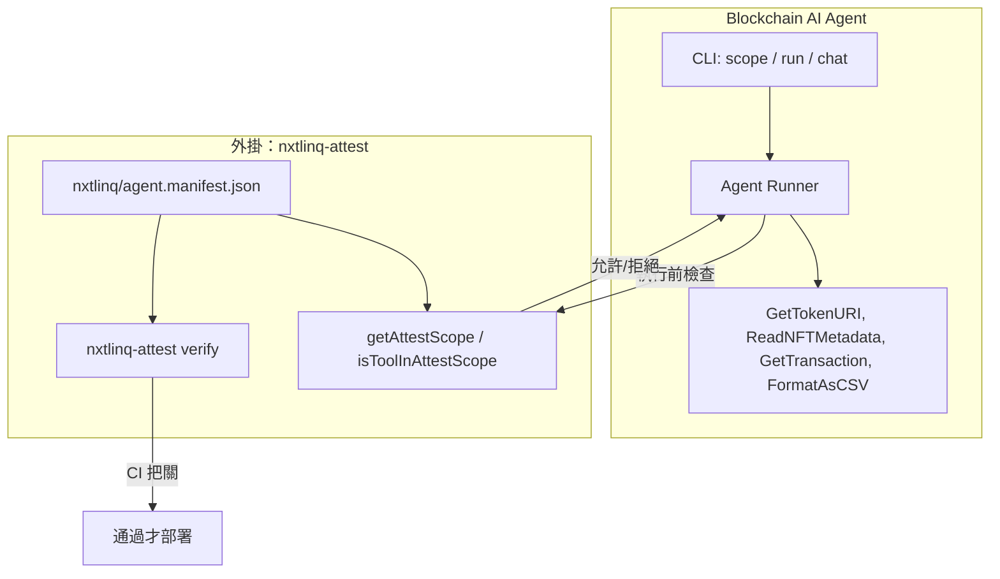
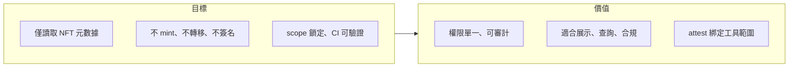
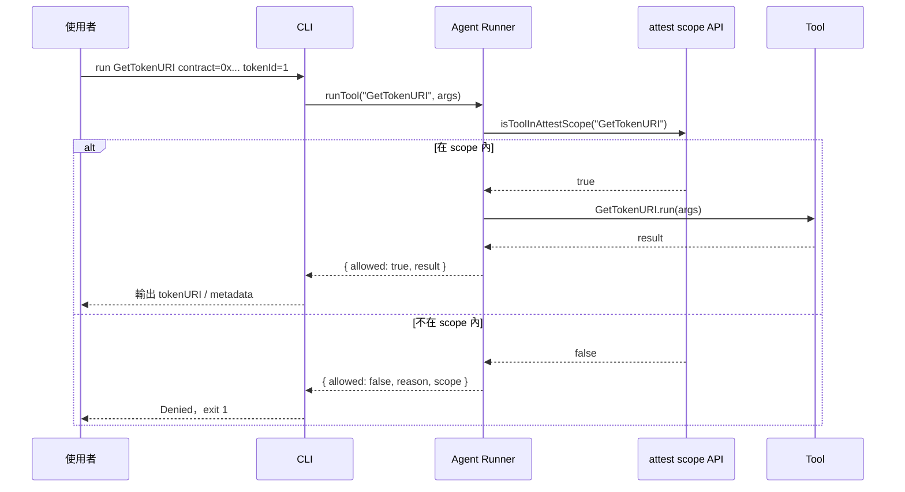
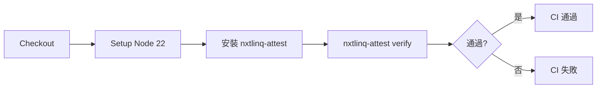

# Blockchain AI Agent 產品規格書

---

## 1. 總覽

### 1.1 產品定位

Blockchain AI Agent 專注於**讀取 NFT 元數據**與**查詢鏈上交易**：依合約與 tokenId 查詢 `tokenURI`，從 URI（IPFS、HTTP 等）取得與解析 metadata（name、description、image、attributes），並依 tx hash 查詢交易與 receipt（支援 Ethereum、Arbitrum One、Arbitrum Nova）。亦可將資料整理為 CSV 並寫入 `output/` 資料夾。不執行 mint、轉移或任何鏈上寫入；權限由 nxtlinq-attest 外掛鎖定在宣告的工具內，便於審計與合規。

### 1.2 核心能力

| 能力 | 說明 |
|------|------|
| **GetTokenURI** | 依合約地址與 tokenId 取得 tokenURI（ERC-721 / ERC-1155）。實作上可透過 RPC 呼叫 `tokenURI(tokenId)`。 |
| **ReadNFTMetadata** | 從給定 URI 取得並解析 NFT metadata JSON（name、description、image、attributes 等）。支援 IPFS、HTTP 等。 |
| **GetTransaction** | 依 tx hash 取得交易與 receipt。支援 chainId（1 = Ethereum，42161 = Arbitrum One，42170 = Arbitrum Nova）。 |
| **FormatAsCSV** | 將 JSON 轉為 CSV；可選參數 `output` 會寫入 `output/`（資料夾不存在時自動建立）。數值與狀態欄位依 Blockscout 風格呈現。 |

僅在 **attested scope** 內宣告的工具可被執行；未在 scope 內的請求會被拒絕。

### 1.3 系統架構概觀



### 1.4 目標與價值



| 價值 | 說明 |
|------|------|
| **權限單一** | scope 僅含宣告之工具（如 GetTokenURI、ReadNFTMetadata），易說明、易審計。 |
| **讀取專用** | 不碰私鑰、不發交易，適合前端展示、客服查詢、合規報告。 |
| **CI 把關** | 在 CI 中執行 attest verify，確保程式與宣告未被竄改。 |

### 1.5 與 attest 的關係

Blockchain AI Agent **使用** nxtlinq-attest 作為外掛；產品名不與 attest 綁定。

- **主體**：Blockchain AI Agent（讀取 tokenURI、metadata 與鏈上交易；可將資料匯出為 CSV）。
- **外掛**：nxtlinq-attest 提供 manifest 簽名、驗證與 runtime scope API；Agent 透過 `isToolInAttestScope(toolName)` 強制僅執行 scope 內工具。
- **命名**：產品名稱為 Blockchain AI Agent（或 blockchain-ai-agent），不包含 nxtlinq/attest。

---

## 2. 功能規格

### 2.1 CLI 指令

| 指令 | 說明 |
|------|------|
| `blockchain-ai-agent scope` | 輸出當前 attested scope（來自 nxtlinq/agent.manifest.json）的 JSON。 |
| `blockchain-ai-agent run <tool> [key=val ...]` | 執行指定工具；若工具不在 scope 內則拒絕並列出 scope。 |
| `blockchain-ai-agent chat <message>` | 自然語言查詢；AI 依需求呼叫工具（需設定 OPENAI_API_KEY）。仍受 attest scope 控管。 |

### 2.2 工具與參數

| 工具 | 參數 | 說明 |
|------|------|------|
| GetTokenURI | `contract`, `tokenId` | 取得該合約、tokenId 的 tokenURI（mock 或 RPC）。 |
| ReadNFTMetadata | `uri` | 從 URI 取得並解析 NFT metadata（mock 或 fetch）。 |
| GetTransaction | `txHash`，`chainId`（選填，預設 42170） | 依 hash 透過鏈 RPC 取得交易與 receipt。 |
| FormatAsCSV | `data`（JSON 字串），`columns`（選填），`output`（選填） | 將 JSON 轉為 CSV；若設 `output` 則寫入 `output/<路徑>`。 |

### 2.3 執行流程



---

## 3. 專案結構

### 3.1 目錄與檔案

```
blockchain-ai-agent/
├── src/
│   ├── agent.ts      # runTool、getScope；依 attest scope 放行/拒絕
│   ├── tools.ts      # GetTokenURI, ReadNFTMetadata, GetTransaction, FormatAsCSV
│   └── cli.ts        # CLI 進入點
├── nxtlinq/          # 由 nxtlinq-attest 管理（外掛）
│   ├── agent.manifest.json
│   ├── agent.manifest.sig
│   ├── public.key
│   └── private.key   # 勿 commit
├── docs/
│   ├── index.html
│   └── spec/
│       ├── blockchain-ai-agent-product-spec.md      # 英文（預設）
│       └── blockchain-ai-agent-product-spec.zh.md  # 中文
├── .github/workflows/attest.yml
├── package.json
└── README.md
```

### 3.2 Scope 設計

| 項目 | 說明 |
|------|------|
| **GetTokenURI** | 僅讀取鏈上或已知來源的 tokenURI，不寫入、不發送交易。 |
| **ReadNFTMetadata** | 僅依 URI 讀取並解析 JSON metadata，不寫入鏈上。 |
| **GetTransaction** | 僅從鏈 RPC 讀取交易與 receipt，不寫入。 |
| **FormatAsCSV** | 將記憶體內 JSON 轉為 CSV；僅可寫入目前工作目錄下的 `output/`。 |

不納入 scope 的範例：簽名、發送交易、mint、transfer、在 `output/` 以外的任意檔案寫入。權限邊界清楚，利於區塊鏈場景的合規與審計。

---

## 4. CI 與驗證

### 4.1 CI 流程



每次 push/PR 執行 `.github/workflows/attest.yml`，於專案根目錄執行 `nxtlinq-attest verify`；失敗則 CI 不通過。

### 4.2 開發者流程

1. **初次設定**：`nxtlinq-attest init`，編輯 manifest 的 `name`（blockchain-ai-agent）、`scope`（如 tool:GetTokenURI、tool:ReadNFTMetadata、tool:GetTransaction、tool:FormatAsCSV），再 `nxtlinq-attest sign`。
2. **程式或 scope 變更**：需重新 `nxtlinq-attest sign`，否則 CI verify 會因 hash 不符而失敗。
3. **勿 commit**：`nxtlinq/private.key` 不得提交。

---

## 5. 規格摘要

| 項目 | 說明 |
|------|------|
| **產品名稱** | Blockchain AI Agent（blockchain-ai-agent） |
| **主體能力** | 讀取 tokenURI、讀取並解析 NFT metadata、查詢交易、匯出 CSV |
| **權限模型** | 僅執行 attested scope：GetTokenURI、ReadNFTMetadata、GetTransaction、FormatAsCSV |
| **外掛** | nxtlinq-attest（簽名、驗證、scope API） |
| **CI** | GitHub Actions 執行 nxtlinq-attest verify |
